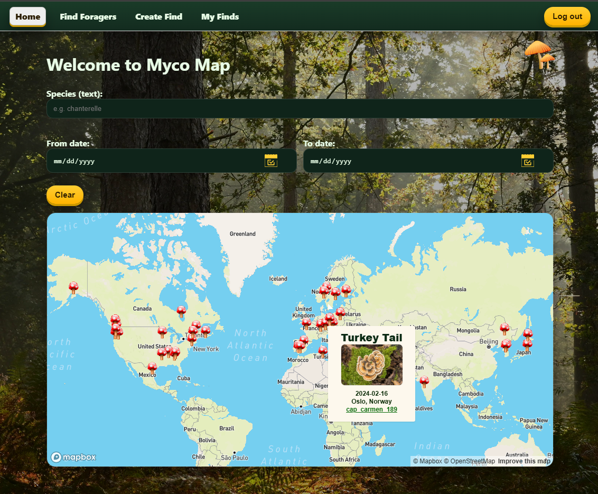
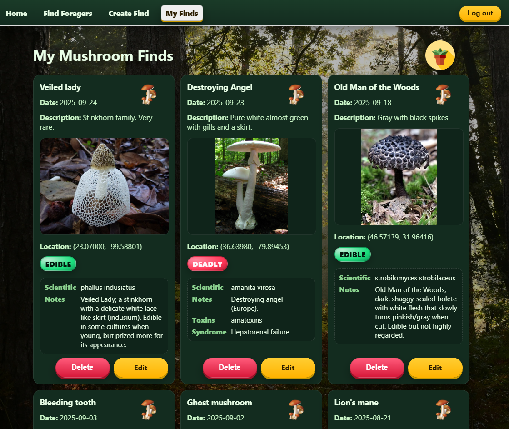
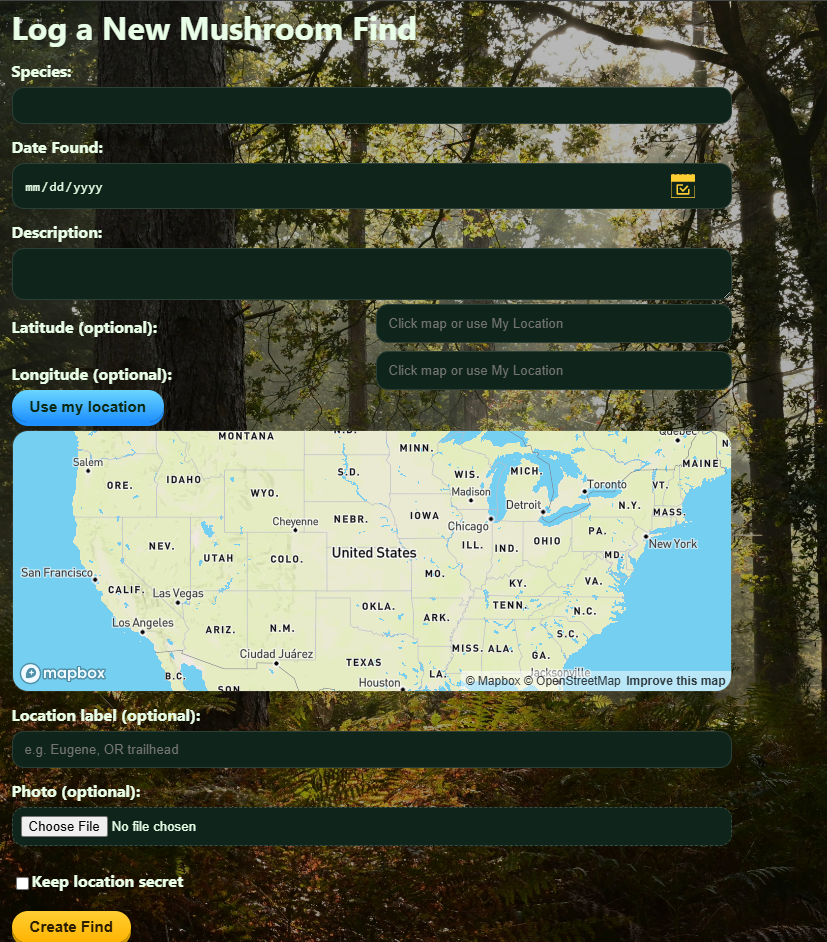

# MycoMap Client (`mycomap-client`)

React + Vite frontend for MycoMap: a community-driven (citizen-science) mushroom find logging app.

This UI focuses on quick field logging, privacy-friendly location sharing, and a map view that turns individual observations into a browsable dataset.

## What it does

- **Map of public finds** using Mapbox GL JS with marker popups.
- **Filtering** by species text and date range.
- **Auth** (register/login/logout) backed by the API; JWT token stored in `sessionStorage`.
- **Personal log management**: create, edit, and delete your own finds.
- **Photo uploads** and resilient image display (broken images fall back to a placeholder).
- **Privacy option**: hide sensitive locations to protect habitats.
- **Find foragers**: debounced username search and public user logs.

Pairs with the backend repo `mycomap-server` (REST API).

## Tech stack

- React 19
- React Router
- Vite
- Mapbox GL JS
- CSS (Grid/Flexbox)

## Screenshots





## Local setup

Prereqs:

- Node.js `>= 22`
- A Mapbox token
- A running instance of `mycomap-server`

1. Install dependencies

```bash
npm install
```

2. Create `.env`

```bash
VITE_API_URL=http://localhost:3000
VITE_MAPBOX_TOKEN=your_mapbox_token
```

Note: Only variables prefixed with `VITE_` are exposed to the client.

3. Start the dev server

```bash
npm run dev
```

Vite typically runs at `http://localhost:5173`.

## Build

```bash
npm run build
```

For production, set `VITE_API_URL` to your deployed backend base URL.

## Deployment notes

- This is a client-side routed SPA. The repo includes `public/_redirects` so hosts like Netlify can route all paths to `index.html`.
- Vite outputs a production build to `dist/`.
- In your host’s environment settings, set `VITE_API_URL` and `VITE_MAPBOX_TOKEN` the same way you would locally.

Netlify settings (typical):

- Build command: `npm run build`
- Publish directory: `dist`
- Environment variables: `VITE_API_URL`, `VITE_MAPBOX_TOKEN`

## Implementation notes (high level)

- The map page fetches public finds and renders markers; popups include images with a safe fallback.
- Create Find supports manual coordinates, “use my location”, and a small map for picking/dragging a marker.
- Image URLs can be absolute (S3) or relative paths served by the API; the client handles both.

## Accessibility & UX

- Semantic markup with ARIA labels on key flows (filters, forms, error output)
- Keyboard-focusable map regions and cards
- Loading and error states surfaced in the UI
